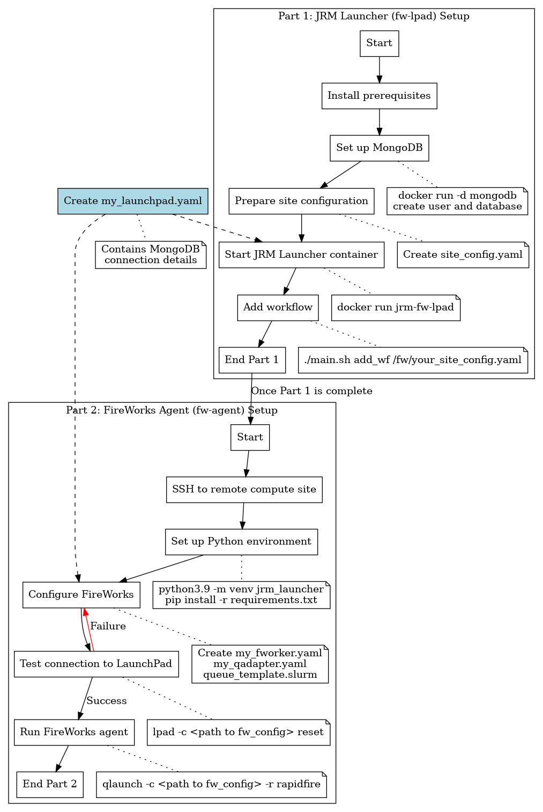
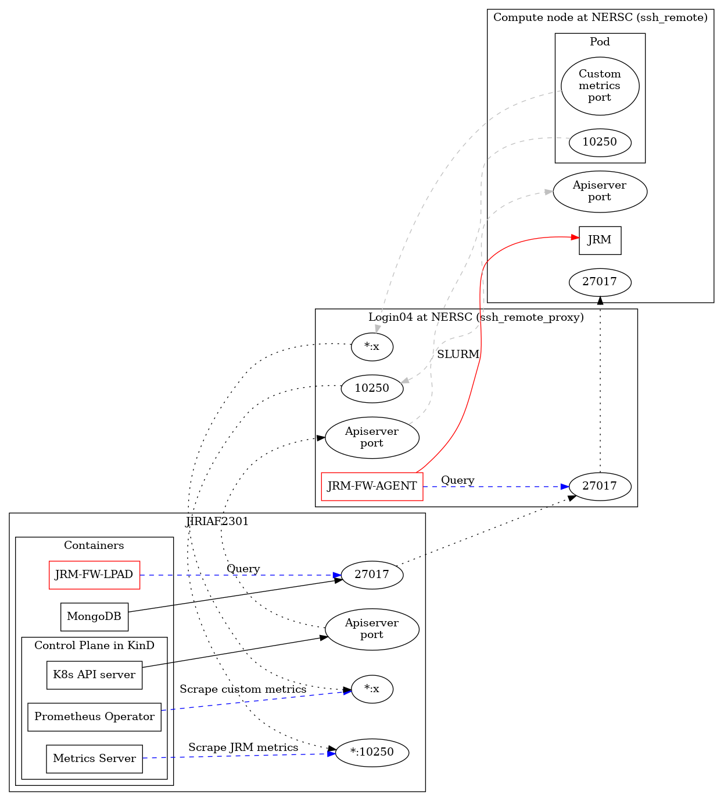

# JRM Launcher

JRM Launcher is a tool designed to manage and launch Job Resource Manager (JRM) instances across various computing environments, with a focus on facilitating complex network connections in distributed computing setups.

## JRM Launcher Deployment Overview

The following flow chart provides an overview of the JRM Launcher deployment process:

[](markdown/jrm_launcher_flow_chart.png)

This diagram illustrates the key steps involved in setting up and deploying the JRM Launcher, including the setup of both the fw-lpad and fw-agent components, as well as the workflow management process.

## Detailed Step-by-Step Guide

### Part 1: Setting up JRM Launcher (fw-lpad)

For more detailed instructions on setting up the JRM Launcher, please refer to the [@fw-lpad/readme.md](fw-lpad/readme.md).

1. Install prerequisites:
   - Have valid NERSC account, ORNL user account, or other remote computing site account
   - MongoDB (for storing workflow of JRM launches)
   - Kubernetes control plane installed
   - Valid kubeconfig file for the Kubernetes cluster
   - Docker
   - Python 3.9 (for developers)

2. Set up MongoDB for storing Fireworks workflows:
   ```bash
   # Create and start a MongoDB container
   docker run -d -p 27017:27017 --name mongodb-container \
     -v $HOME/JIRIAF/mongodb/data:/data/db mongo:latest

   # Wait for MongoDB to start (about 10 seconds), then create a new database and user
   docker exec -it mongodb-container mongosh --eval '
     db.getSiblingDB("jiriaf").createUser({
       user: "jiriaf",
       pwd: "jiriaf",
       roles: [{role: "readWrite", db: "jiriaf"}]
     })
   '
   ```

3. Prepare the site configuration file:
   - Use the template in `fw-lpad/FireWorks/jrm_launcher/site_config_template.yaml`
   - Create a configuration file for your specific site (e.g., perlmutter_config.yaml or ornl_config.yaml)

   Example configurations:
   ```yaml:perlmutter_config.yaml
   slurm:
     nodes: 1
     constraint: cpu
     walltime: 00:10:00
     qos: debug
     account: m3792
     reservation: # 100G

   jrm:
     nodename: jrm-perlmutter
     site: perlmutter
     control_plane_ip: jiriaf2302
     apiserver_port: 38687
     kubeconfig: /global/homes/j/jlabtsai/run-vk/kubeconfig/jiriaf2302
     image: docker:jlabtsai/vk-cmd:main
     vkubelet_pod_ips:
       - 172.17.0.1
     custom_metrics_ports: [2221, 1776, 8088, 2222]
     config_class:

   ssh:
     remote_proxy: jlabtsai@perlmutter.nersc.gov
     remote: loginXX # where XX is the number of a login node on Perlmutter (e.g., login33)
     ssh_key: /root/.ssh/nersc
     password:
     build_script:
   ```

   ```yaml:ornl_config.yaml
   slurm:
     nodes: 1
     constraint: ejfat
     walltime: 00:10:00
     qos: normal
     account: csc266
     reservation: #ejfat_demo

   jrm:
     nodename: jrm-ornl
     site: ornl
     control_plane_ip: jiriaf2302
     apiserver_port: 38687
     kubeconfig: /ccsopen/home/jlabtsai/run-vk/kubeconfig/jiriaf2302
     image: docker:jlabtsai/vk-cmd:main
     vkubelet_pod_ips:
       - 172.17.0.1
     custom_metrics_ports: [2221, 1776, 8088, 2222]
     config_class:

   ssh:
     remote_proxy:
     remote: 172.30.161.5
     ssh_key:
     password: < user password in base64 >
     build_script: /root/build-ssh-ornl.sh
   ```

4. Prepare necessary files and directories:
   - Create a directory for logs
   - Create a `port_table.yaml` file
   - Ensure you have the necessary SSH key (e.g., for NERSC access)
   - Create a `my_launchpad.yaml` file with the MongoDB connection details:
     ```yaml:my_launchpad.yaml
     host: localhost
     logdir: <path to logs>
     mongoclient_kwargs: {}
     name: jiriaf
     password: jiriaf
     port: 27017
     strm_lvl: INFO
     uri_mode: false
     user_indices: []
     username: jiriaf
     wf_user_indices: []
     ```

5. Copy the kubeconfig file to the remote site:
   ```bash
   scp /path/to/local/kubeconfig user@remote:/path/to/remote/kubeconfig
   ```

6. Start the JRM Launcher container:
   ```bash
   export logs=/path/to/your/logs/directory
   docker run --name=jrm-fw-lpad -itd --rm --net=host \
     -v ./your_site_config.yaml:/fw/your_site_config.yaml \
     -v $logs:/fw/logs \
     -v `pwd`/port_table.yaml:/fw/port_table.yaml \
     -v $HOME/.ssh/nersc:/root/.ssh/nersc \
     -v `pwd`/my_launchpad.yaml:/fw/util/my_launchpad.yaml \
     jlabtsai/jrm-fw-lpad:main
   ```

7. Verify the container is running:
   ```bash
   docker ps
   ```

8. Log into the container:
   ```bash
   docker exec -it jrm-fw-lpad /bin/bash
   ```

9. Initialize the launchpad: Inside the container run
   ```bash
   lpad -l /fw/util/my_launchpad.yaml reset
   ```

10. Add a workflow:
   ```bash
   ./main.sh add_wf /fw/your_site_config.yaml
   ```

11. Note the workflow ID provided for future reference

### Part 2: Setting up FireWorks Agent (fw-agent) on Remote Compute Site

For more detailed instructions on setting up the FireWorks Agent, please refer to the [@fw-agent/readme.md](fw-agent/readme.md).

1. SSH into the remote compute site

2. Create a new directory for your FireWorks agent:
   ```bash
   mkdir fw-agent
   cd fw-agent
   ```

3. Copy the `requirements.txt` file to this directory (you may need to transfer it from your local machine)

4. Create a Python virtual environment and activate it:
   ```bash
   python3.9 -m venv jrm_launcher
   source jrm_launcher/bin/activate
   ```

5. Install the required packages:
   ```bash
   pip install -r requirements.txt
   ```

6. Create the `fw_config` directory and necessary configuration files:
   ```bash
   mkdir fw_config
   cd fw_config
   ```

7. Create and configure the following files in the `fw_config` directory:
   - `my_fworker.yaml`:
     ```yaml:my_fworker.yaml
     # For Perlmutter:
     category: perlmutter
     name: perlmutter
     query: '{}'

     # For ORNL:
     # category: ornl
     # name: ornl
     # query: '{}'
     ```
   - `my_qadapter.yaml`:
     ```yaml:my_qadapter.yaml
     _fw_name: CommonAdapter
     _fw_q_type: SLURM
     _fw_template_file: <path to queue_template.yaml>
     rocket_launch: rlaunch -c <path to fw_config> singleshot
     nodes: 
     walltime:
     constraint:
     account:
     job_name:
     logdir: <path to logs>
     pre_rocket:
     post_rocket:
     ```
   - `my_launchpad.yaml`:
     ```yaml:my_launchpad.yaml
     host: localhost
     logdir: <path to logs>
     mongoclient_kwargs: {}
     name: jiriaf
     password: jiriaf
     port: 27017
     strm_lvl: INFO
     uri_mode: false
     user_indices: []
     username: jiriaf
     wf_user_indices: []
     ```
   - `queue_template.yaml`:
     ```yaml:queue_template.yaml
     #!/bin/bash -l

     #SBATCH --nodes=$${nodes}
     #SBATCH --ntasks=$${ntasks}
     #SBATCH --ntasks-per-node=$${ntasks_per_node}
     #SBATCH --cpus-per-task=$${cpus_per_task}
     #SBATCH --mem=$${mem}
     #SBATCH --gres=$${gres}
     #SBATCH --qos=$${qos}
     #SBATCH --time=$${walltime}
     #SBATCH --partition=$${queue}
     #SBATCH --account=$${account}
     #SBATCH --job-name=$${job_name}
     #SBATCH --license=$${license}
     #SBATCH --output=$${job_name}-%j.out
     #SBATCH --error=$${job_name}-%j.error
     #SBATCH --constraint=$${constraint}
     #SBATCH --reservation=$${reservation}

     $${pre_rocket}
     cd $${launch_dir}
     $${rocket_launch}
     $${post_rocket}
     ```

8. Test the connection to the LaunchPad database:
   ```bash
   lpad -c <path to fw_config> reset
   ```
   If prompted "Are you sure? This will RESET your LaunchPad. (Y/N)", type 'N' to cancel

9. Run the FireWorks agent:
   ```bash
   qlaunch -c <path to fw_config> -r rapidfire
   ```

### Managing Workflows and Connections

Use the following commands on the fw-lpad machine to manage workflows and connections:

- Delete a workflow:
  ```bash
  ./main.sh delete_wf <workflow_id>
  ```
- Delete ports:
  ```bash
  ./main.sh delete_ports <start_port> <end_port>
  ```
- Connect to database:
  ```bash
  ./main.sh connect db /fw/your_site_config.yaml
  ```
- Connect to API server:
  ```bash
  ./main.sh connect apiserver 35679 /fw/your_site_config.yaml
  ```
- Connect to metrics server:
  ```bash
  ./main.sh connect metrics 10001 vk-node-1 /fw/your_site_config.yaml
  ```
- Connect to custom metrics:
  ```bash
  ./main.sh connect custom_metrics 20001 8080 vk-node-1 /fw/your_site_config.yaml
  ```

## Troubleshooting

- Check logs in the `LOG_PATH` directory for SSH connection issues
- Ensure all configuration files are correctly formatted and contain required fields
- Verify that necessary ports are available and not blocked by firewalls
- For fw-agent issues:
  - Ensure the FireWorks LaunchPad is accessible from the remote compute site
  - Verify that the Python environment has all necessary dependencies installed
- Consult the FireWorks documentation for more detailed configuration and usage information

For more detailed troubleshooting information, please refer to the [@fw-lpad/readme.md](fw-lpad/readme.md) and [@fw-agent/readme.md](fw-agent/readme.md) files.

## Network Architecture

The core functionality of JRM Launcher revolves around managing network connections between different components of a distributed computing environment. The network architecture is visually represented in the [jrm-network-flowchart.png](markdown/jrm-network-flowchart.png) file included in this repository.

[](markdown/jrm-network-flowchart.png)

This diagram illustrates the key components and connections managed by JRM Launcher (JRM-FW), including:

1. SSH connections to remote servers
2. Port forwarding for various services
3. Connections to databases, API servers, and metrics servers
4. Workflow management across different computing nodes

JRM Launcher acts as a central management tool, orchestrating these connections to ensure smooth operation of distributed workflows and efficient resource utilization.

## Key Features

- Workflow management
- Flexible connectivity to various services
- Site-specific configurations
- SSH integration and port forwarding
- Port management for workflows
- Extensibility to support new computing environments

## Extensibility

JRM Launcher is designed to be easily extensible to support various computing environments. For information on how to add support for new environments, refer to the "Customization" section in the [fw-lpad readme](fw-lpad/readme.md) file.

By leveraging JRM Launcher, you can simplify the management of complex network connections in distributed computing environments, allowing you to focus on your workflows rather than infrastructure management.

### Quick Start with Docker Compose

For a simplified setup using Docker Compose:

1. Navigate to the docker-compose directory:
   ```bash
   cd docker-compose
   ```

2. Make the startup script executable:
   ```bash
   chmod +x start-all.sh
   ```

3. Start the services:
   ```bash
   ./start-all.sh
   ```

4. Add your site configuration:
   ```bash
   ./add-site-config.sh /path/to/your/config.yaml
   ```

5. For ORNL users, update your account name (optional):
   ```bash
   ./update-ornl-account.sh your_account_name
   ```

The container comes with example configurations for different sites (perlmutter-example.yaml,
ornl-example.yaml) that you can use as templates for your own configuration.

To update SSH keys without restarting the container:
```bash
./update-ssh-key-live.sh
```

The Docker Compose setup automatically:
- Creates and configures MongoDB with the required database and user
- Mounts necessary volumes for logs and SSH keys
- Sets up proper networking
- Manages the SSH connections service
- Provides example site configurations
- Initializes default ORNL account settings (jlabtsai)

For more detailed instructions on using Docker Compose, see the [docker-compose/README.md](docker-compose/README.md).
