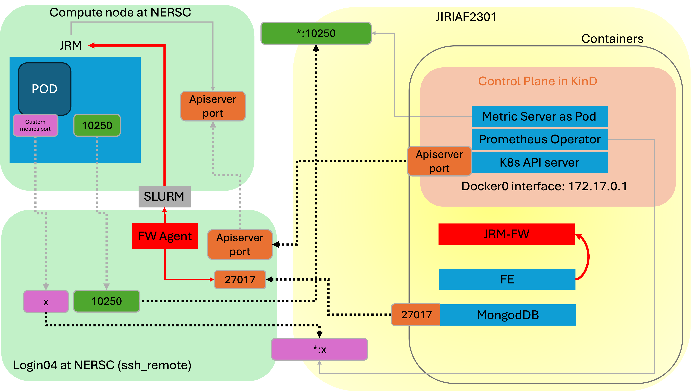

# JRM Launcher

JRM Launcher is a tool designed to manage and launch Job Resource Manager (JRM) instances across various computing environments, with a focus on facilitating complex network connections in distributed computing setups.

## Quick Start Guide

### 1. Setup fw-lpad (JRM Launcher)

1. Ensure you have the necessary prerequisites installed:
   - MongoDB (for storing workflow of JRM launches)
   - Kubernetes API server running
   - Valid kubeconfig file for the Kubernetes cluster
   - Docker

2. Create a site-specific configuration file based on the template in `fw-lpad/FireWorks/jrm_launcher/site_config_template.yaml`.

3. Prepare necessary files and directories:
   - Site configuration file (e.g., `perlmutter_config.yaml`)
   - Directory for logs
   - `port_table.yaml` file
   - SSH key (e.g., for NERSC access)

4. Copy the kubeconfig file to the remote site:
   ```bash
   scp /path/to/local/kubeconfig user@remote:/path/to/remote/kubeconfig
   ```

5. Start the JRM Launcher container:
   ```bash
   export logs=/path/to/your/logs/directory
   docker run --name=jrm-fw-lpad -itd --rm --net=host \
     -v ./perlmutter_config.yaml:/fw/perlmutter_config.yaml \
     -v $logs:/fw/logs \
     -v `pwd`/port_table.yaml:/fw/port_table.yaml \
     -v $HOME/.ssh/nersc:/root/.ssh/nersc \
     jlabtsai/jrm-fw-lpad:main
   ```

### 2. Setup fw-agent (FireWorks Agent)

1. On the remote compute site, create a new directory for your FireWorks agent:
   ```bash
   mkdir fw-agent
   cd fw-agent
   ```

2. Create a Python virtual environment and activate it:
   ```bash
   python3 -m venv venv
   source venv/bin/activate
   ```

3. Copy the `requirements.txt` file and install the required packages:
   ```bash
   pip install -r requirements.txt
   ```

4. Copy the `fw_config` directory containing site-specific configuration files.

5. Configure the FireWorks files (`my_fworker.yaml`, `my_qadapter.yaml`, `my_launchpad.yaml`, `queue_template.yaml`) for your specific compute site.

### 3. Launch JRM and Manage Workflows

1. On the fw-lpad machine, log into the container:
   ```bash
   docker exec -it jrm-fw-lpad /bin/bash
   ```

2. Add a workflow:
   ```bash
   ./main.sh add_wf --site_config_file /fw/perlmutter_config.yaml
   ```

3. On the remote compute site (fw-agent), start the FireWorks agent:
   ```bash
   qlaunch -r rapidfire
   ```

4. Manage workflows and connections using the `main.sh` script on the fw-lpad machine:
   - Delete a workflow: `./main.sh delete_wf --fw_id <workflow_id>`
   - Delete ports: `./main.sh delete_ports --start <start_port> --end <end_port>`
   - Connect to services:
     - Database: `./main.sh connect --connect_type db --site_config_file /path/to/config.yaml`
     - API server: `./main.sh connect --connect_type apiserver --port <port> --site_config_file /path/to/config.yaml`
     - Metrics server: `./main.sh connect --connect_type metrics --port <port> --nodename <node> --site_config_file /path/to/config.yaml`
     - Custom metrics: `./main.sh connect --connect_type custom_metrics --mapped_port <port1> --custom_metrics_port <port2> --nodename <node> --site_config_file /path/to/config.yaml`

For more detailed usage instructions, refer to the [fw-lpad readme](fw-lpad/readme.md) and [fw-agent readme](fw-agent/readme.md).

## Network Architecture

The core functionality of JRM Launcher revolves around managing network connections between different components of a distributed computing environment. The network architecture is visually represented in the [jrm-network](jrm-network.png) file included in this repository.

[](markdown/jrm-network.png)

This diagram illustrates the key components and connections managed by JRM Launcher (JRM-FW), including:

1. SSH connections to remote servers
2. Port forwarding for various services
3. Connections to databases, API servers, and metrics servers
4. Workflow management across different computing nodes

JRM Launcher acts as a central management tool, orchestrating these connections to ensure smooth operation of distributed workflows and efficient resource utilization.

## Key Features

- Workflow management
- Flexible connectivity to various services
- Site-specific configurations
- SSH integration and port forwarding
- Port management for workflows
- Extensibility to support new computing environments

## Extensibility

JRM Launcher is designed to be easily extensible to support various computing environments. For information on how to add support for new environments, refer to the "Customization" section in the [fw-lpad readme](fw-lpad/readme.md) file.

## Troubleshooting

For troubleshooting tips and logging information, please consult the "Troubleshooting" section in the [fw-lpad readme](fw-lpad/readme.md) file.
By leveraging JRM Launcher, you can simplify the management of complex network connections in distributed computing environments, allowing you to focus on your workflows rather than infrastructure management.
